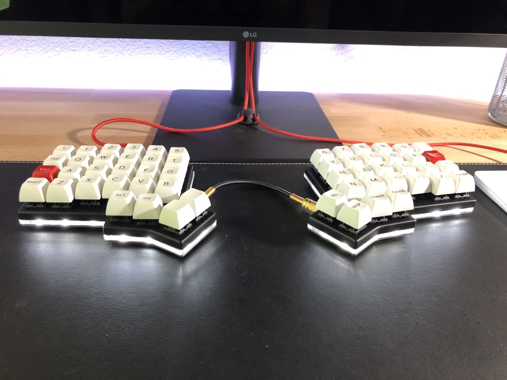
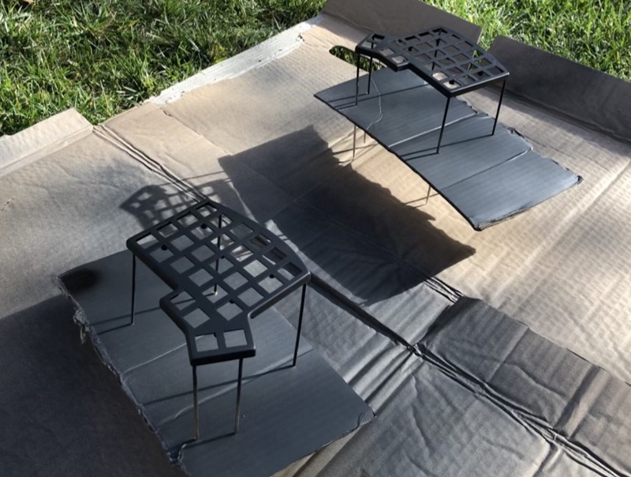
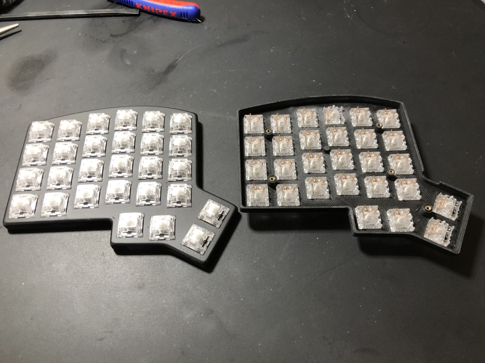
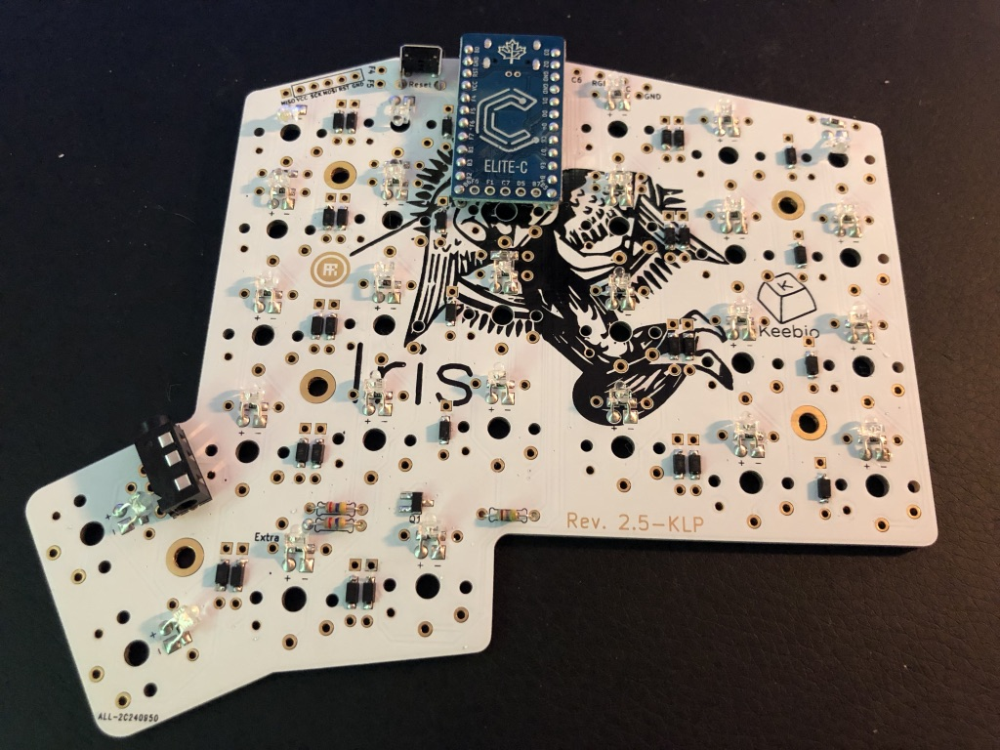

# The Iris Ice Project

The Iris Ice Project is a build of the Iris keyboard with custom made case composed of a 3D printed switch top plate, a translucent laser cut acrylic middle plate and a brushed still bottom plate.

Backlight LEDs are mounted reversed to create a cold white underglow. The TRRS cable is also custom made to fit the right size. Keycaps are from the [SA "Ice Cap"](https://pimpmykeyboard.com/sa-ice-cap-keyset/) keyset from signature plastic.

Here is the result:

In this repository, you will find all the material needed to reproduce this build.

## Build List

Here is the list of material you'll need for this build:

* [The Iris PCB kit](https://keeb.io/collections/frontpage/products/iris-keyboard-split-ergonomic-keyboard) with [LED support components](https://keeb.io/products/led-support-components-add-on?variant=8112255107178) (no LED strip underglow)
* [100 white LEDs](https://spacecat.design/collections/do-it-yourself/products/1-8mm-leds) (pay attention to the color select, default is orange)
* [2 Elite-C](https://keeb.io/collections/frontpage/products/elite-c-usb-c-pro-micro-replacement-arduino-compatible-atmega32u4) (or pro-micro)
* [Peel-A-Way sockets](https://keeb.io/products/peel-a-way-sockets-for-pro-micros-and-leds?variant=12972145344606) (optional)
* [SA "Ice Cap" keyset](https://pimpmykeyboard.com/sa-ice-cap-keyset/)
* 68 switches of your choice (I used jailed, lubed MX blue)
* [A black with sheath TRRS cable](https://keeb.io/collections/frontpage/products/trrs-cable?variant=46391966598)
* [2 TRRS plugs](https://www.amazon.com/gp/product/B01ASF4IT0)
* Sand paper (I use 120 and 220 grits)
* [Primer spray](https://www.amazon.com/Design-Master-Primer-Surface-Preparation/dp/B000XZU00C)
* [Carbon black spray paint](https://www.amazon.com/Liquitex-Professional-Spray-Paint-Carbon/dp/B008LUIUXU)
* [Matte finish spray](https://www.amazon.com/KRYLON-DIVERSIFIED-K01311007-Aerosol-11-Ounce/dp/B005ENZ8CS)
* [M2 x 3mm insert nuts](https://www.amazon.com/gp/product/B01IZ157KS)
* [M2 x 8mm flat head cross countersunk screws](https://www.amazon.com/gp/product/B07FD3CBLW)
* [55% translucent acrylic sheet](https://www.amazon.com/gp/product/B01DYSVPCQ)

This build also assume that you have:
* A solder iron
* A 3D printer (or a way to order printing jobs)
* A laser cutter (or a way to order a cutting job)
* The bottom metal plate is ordered on [LaserBoost](https://www.laserboost.com)

## Build Log

### Top Layer

* Print the [top-left.stl](top-left.stl) and [toip-right.stl](top-right.stl).
* Sand each piece to remove the printing lines and get a smooth surface
* Apply 2–3 layers of primer
* Apply 3 layers of paint
* Apply 2-3 layers of matte finish

* Using the pointy tip of a solder iron, insert 5 M2 inserts into the screw holes of each case
* Insert the switches

### PCB Assembly

* Follow the [Iris Build Guide](https://docs.keeb.io/iris-build-guide/)
* [Optional] Use peel-a-way sockets to solder the controller
* When it comes to the LEDs, solder them on the bottom side of the PCB, before inserting the switches. It is better to fold the led 90° so it can fit better in the case. You may want to fold them on the opposite direction as on the picture below though

* Align the PCB with the top layer switches and solder

### Middle Layer

Cut 2 pieces in the acrylic using [middle.dxf](middle.dxf). The kerf is assumed to be 0.09, make sure to edit it if your laser cutter requires a different setup.

### Bottom Layer

Go on [LaserBoost](https://shop.laserboost.com/en/create) and upload the [bottom.dxf] file. Select "Stainless Steel", "304 Stainless Steel Shiny Finish", 3mm. In the "special request for this part" text area, write:
Back-side brushing

> Please brush the edges. Add countersink to all the holes in order to hide a GB819-M2. Make the same piece twice but in mirror (countersinks on opposite side).

### TRRS Cable (optional)

Cut the TRRS cable at the desired length, and solder the plugs.